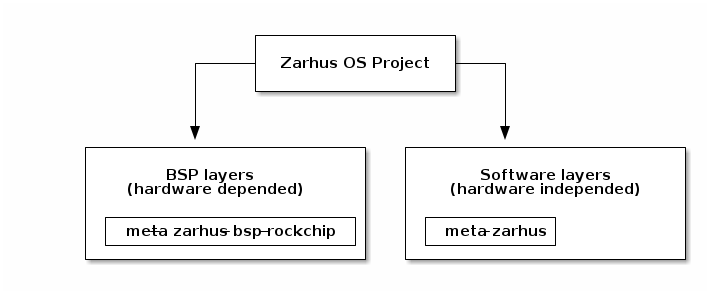

# Managing Zarhus layers

This guide will describe how to add a Yocto layer into Zarhus in case you want
to experiment or to build your custom Zarhus OS image.

!!! warning

    This guide is recommended for advanced users, because adding or removing
    layers can cause build time problems as well as runtime problems which are
    hard to debug.

## Currently used layers

Currently, we use following custom layers:

* `meta-zarhus` - common across all platforms;
* `meta-bsp-rockchip` - contains metadata for Rockchip target(s);



<!--
@startditaa
                       +-------------------+
                       |                   |
                 +-----+ Zarhus OS Project +----+
                 |     |                   |    |
                 |     +-------------------+    |
                 |                              |
                 |                              |
                 v                              v
      +----------+----------------+   +---------+-----------------+
      |                           |   |                           |
      |       BSP layers          |   |      Software layers      |
      |   (hardware dependent)    |   |   (hardware independent)  |
      |                           |   |                           |
      | +------------------------+|   | +------------+            |
      | |meta-zarhus-bsp-rockchip||   | | meta-zarhus|            |
      | +------------------------+|   | +------------+            |
      +---------------------------+   +---------------------------+

@endditaa
-->

## Adding new layer

### Adding already existing layer

Most of the active and useful Yocto layers are registered in the
[OpenEmbedded Layer Index](https://layers.openembedded.org/layerindex/branch/master/layers/)
and it should be the first place to look for layers to use.

Layers are added by inserting an entry to the `kas/common.yml` file. For
example, this is how the `meta-openembedded` could be added:

```yml
  meta-openembedded:
    url: https://git.openembedded.org/meta-openembedded
    refspec: 2a5c534d2b9f01e9c0f39701fccd7fc874945b1c
    layers:
      meta-oe:
      meta-networking:
      meta-python:
      meta-filesystems:
```

* the `url` points to the repository location;
* the `refspec` is a SHA1 of git commit we want to use;
* the `layers` section is optional:
    - if it does not exist, the `kas` assumes that the root directory is a layer
    itself;
    - if it exists, we can choose which layers from given repository should be
    enabled - in this example we enable `oe`, `networking`, `python` and
    `filesystem` layers, but the `meta-openembedded` repository has a few more
    available;

!!! question "What is `kas/common.yml` file?"

    In Zarhus Project [a tool named
    `kas-container`](https://github.com/siemens/kas) is being used for building
    images, so the `meta-zarhus` layer contains several `.yml` files to work on.
    The `kas/common.yml` contains common definitions for all images being build
    (e.g. common layers or common `bitbake` variables).

More details can be found in the
[kas user guide](https://kas.readthedocs.io/en/latest/userguide.html).

### Creating a new layer

A layer is a directory which contains some metadata gathered in the
configuration files (`*.conf`), recipes (`*.bb`) or append files
(`*.bbappend`). The crucial file which defines that the given directory is a
layer is the `conf/local.conf` file within that directory. The content of this
file describes what kind of metadata files can be found within their layer, and
what are their paths. More about the `Yocto Project Layer Model` can be found
in the [Yocto documentation](https://docs.yoctoproject.org/singleindex.html#).

Once we create our custom layer, we can add it to the build in the same way as
we are [adding an already existing layer](#adding-already-existing-layer).

#### Manually

* Create a directory structure:

```bash
$ mkdir -p meta-layer-a/conf meta-layer-a/recipes-layer-a
```

* Create a license file, for example use the `MIT` license:

> Adjust the copyright holder data within the file.

```bash
$ wget -O meta-layer-a/COPYING.MIT https://raw.githubusercontent.com/spdx/license-list-data/master/text/MIT.txt
```

* Create a `layer.conf` file, based on `layer.conf` file from one of the
  already existing layers:

```bash
$ vim meta-layer-a/conf/layer.conf
```

The typical content of `layer.conf` file:

```bb
# We have a conf and classes directory, add to BBPATH
BBPATH .= ":${LAYERDIR}"

# We have recipes-* directories, add to BBFILES
BBFILES += "${LAYERDIR}/recipes-*/*/*.bb \
            ${LAYERDIR}/recipes-*/*/*.bbappend"

BBFILE_COLLECTIONS += "meta-layer-a"
BBFILE_PATTERN_meta-layer-a = "^${LAYERDIR}/"
BBFILE_PRIORITY_meta-layer-a = "6"

LAYERDEPENDS_meta-layer-a = "core"
LAYERSERIES_COMPAT_meta-layer-a = "dunfell"
```

#### Using the bitbake-layers script

* Enter build container shell:

```bash
$ $ SHELL=/bin/bash kas-container shell meta-zarhus/kas-debug.yml
```

* Use the `bitbake-layers` command:

```bash
(docker)$ bitbake-layers create-layer /work/meta-layer-a

NOTE: Starting bitbake server...
Add your new layer with 'bitbake-layers add-layer /work/meta-layer-a'
```

* As a result, following structure is created:

```bash
/work/meta-layer-a/
├── conf
│   └── layer.conf
├── COPYING.MIT
├── README
└── recipes-example
    └── example
        └── example_0.1.bb
```

* Now we can add our recipes specific to the `layer-a` here.
