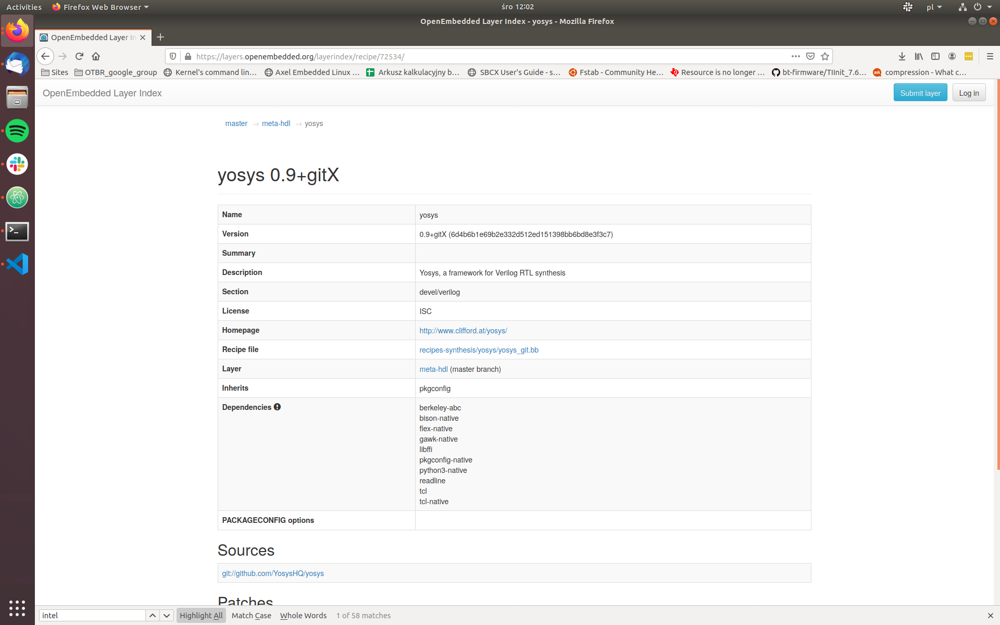
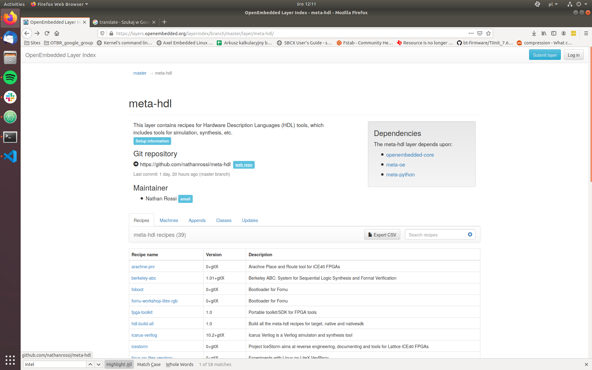

# Managing packages in Zarhus OS

## Description

This guide will describe how to add a package into Zarhus OS image in case you
want to experiment or to build your custom Zarhus OS image.

!!! warning

    This guide is recommended for advanced users, because adding or removing
    packages can cause build time problems as well as runtime problems which are
    hard to debug.

We can have two cases here, where the theory of operation will be different. In
the first one, the recipe for the package we are looking for already exists and
we will simply use it. In the second one, we will need to create the recipe by
ourselves.

The assumption is that a recipe for a given package already exists in one of the
publicly available meta layers.

!!! question "What is a recipe?"

    A recipe is a BitBake concept. It is a file containing metadata describing
    how to fetch the source code for a given piece of software, and later how to
    configure, compile and install it. Check the [BitBake user
    manual](https://docs.yoctoproject.org/current/overview-manual/concepts.html#recipes)
    for more information.

## Look for existing recipe

Before we decide which path we need to follow, we need to know whether the
recipe for given software already exists or not. The
[OpenEmbedded layer index](https://layers.openembedded.org/layerindex/branch/master/recipes/)
can help us with that. It registers most of the layers which may be worth
looking at. If we fail to find a recipe there, there is still a chance of
finding one somewhere else. In such cases simply try to google it. A viable
option is also to look through (or also ask on) the
[Yocto mailing list](https://lists.yoctoproject.org/g/yocto).

### Search recipe for the given software

The OpenEmbedded layer index can be found
[here](https://layers.openembedded.org/layerindex/branch/master/recipes/). For
example we will search for `yosys` recipe. It will serve as an example of adding
a new layer to the `kas/common.yml` file.



If there were more than one recipe available for this package, we would see a
list from which one can choose the appropriate recipe.

As we can see `yosys` is available in the `meta-hdl` layer.

## Add package to the image when the recipe already exists

### Add new layer to `kas/common.yml` file

If the recipe is available in one of the already used layers, this step can be
skipped, otherwise you will need to add an additional layer to your image.

Some recipes are available in layers which are not used in our build yet. In
such cases we need to add them to the `kas/common.yml` file. To install the
`yosys` package, `meta-hdl` layer needs to be added to the `kas/common.yml`
file. We need the URL of the layer repository and refspec of the commit we want
to use. This information can be obtained by clicking on the layer page provided
in the recipe information. There will be a link to the repository page.



!!! question "What is `kas/common.yml` file?"

    In Zarhus [a tool named
    `kas-container`](https://github.com/siemens/kas) is being used for building
    images, so the `meta-zarhus` layer contains several `.yml` files to work on.
    The `kas/common.yml` contains common definitions for all images being build
    (e.g. common layers or common `bitbake` variables).

From there we can open a repository website where we can find information we
need. Then add those lines to `kas/common.yml` file:

```yml
meta-hdl:
	url: https://github.com/nathanrossi/meta-hdl
	refspec: fa82506e0964bfa36519ecaea13c6397e25c81ef
```

`url` is a link to clone `git` repository and `refspec` is a `git` revision.
When choosing which one to use it is best to check if the repository has
branches named as Yocto releases. If it is true, we should take the top commit
from the one matching [the Yocto relase used in
`meta-zarhus`.](https://github.com/zarhus/meta-zarhus/blob/4c51e773af9bef9f5fa4ac2e636eb9e3860c168d/conf/layer.conf#L20)
If the repository does not provide such branches, we should use the top commit
from the `master` branch.

### Add package to the image

Basically, to add a package we need to append its name to the
[`IMAGE_INSTALL`](https://docs.yoctoproject.org/singleindex.html#term-IMAGE_INSTALL)
variable. It can be done in multiple ways. We will describe here two ways of
doing that. The second one can be considered as a better practice to follow.

* Add the package name directly to the image recipe
  (`recipes-zarhus/images/zarhus-base-image.inc`).
    - Adding packages directly to the image recipe may turn out into maintenance
    issues quickly

    ```bb
    IMAGE_INSTALL_append = " \
      packagegroup-zarhus-system \
      yosys \
    "
    ```

* Add the package name to one of the `packagegroups` in the `packagegroups`
  recipe   (`recipes-zarhus/packagegroups/packagegroup-zarhus.bb`)
    - Dividing packages in structured `packagegroup` (e.g. divided by part of
    the system or by a functionality) is easier to maintain in the long run

    ```bb
    RDEPENDS_${PN}-system = " \
      packagegroup-core-base-utils \
      chrony \
      chronyc \
      yosys \
    "
    ```

### Verification

Rebuild and reinstall (update) the system. Log into the platform and check if
the package is available.

```bash
# yosys -H

 /----------------------------------------------------------------------------\
 |                                                                            |
 |  yosys -- Yosys Open SYnthesis Suite                                       |
 |                                                                            |
 |  Copyright (C) 2012 - 2019  Clifford Wolf <clifford@clifford.at>           |
 |                                                                            |
 |  Permission to use, copy, modify, and/or distribute this software for any  |
 |  purpose with or without fee is hereby granted, provided that the above    |
 |  copyright notice and this permission notice appear in all copies.         |
 |                                                                            |
 |  THE SOFTWARE IS PROVIDED "AS IS" AND THE AUTHOR DISCLAIMS ALL WARRANTIES  |
 |  WITH REGARD TO THIS SOFTWARE INCLUDING ALL IMPLIED WARRANTIES OF          |
 |  MERCHANTABILITY AND FITNESS. IN NO EVENT SHALL THE AUTHOR BE LIABLE FOR   |
 |  ANY SPECIAL, DIRECT, INDIRECT, OR CONSEQUENTIAL DAMAGES OR ANY DAMAGES    |
 |  WHATSOEVER RESULTING FROM LOSS OF USE, DATA OR PROFITS, WHETHER IN AN     |
 |  ACTION OF CONTRACT, NEGLIGENCE OR OTHER TORTIOUS ACTION, ARISING OUT OF   |
 |  OR IN CONNECTION WITH THE USE OR PERFORMANCE OF THIS SOFTWARE.            |
 |                                                                            |
 \----------------------------------------------------------------------------/
```

## Add package to the image when the recipe does not exist

If we fail to find the recipe for the software we need (or maybe we have a
custom software) we need to develop the recipe ourselves.

This section will describe how to write a recipe to install some packages to the
image. We will provide three examples:

* A recipe for our custom file (simple shell script as an example),
* A recipe for an open-source software project (Python module as an example),
* A recipe for binary components (printer drivers as an example).

More detailed information can be found in the
["writing a new recipe" section in Yocto Manual](https://docs.yoctoproject.org/singleindex.html#writing-a-new-recipe).

### A recipe for our custom file

This is quite a common scenario that we want to install some additional scripts
or configuration files into the image. A simple shell script is used as an
example, but it can be anything more complicated.

The example shell script looks as follows:

```bash
$ cat file-example.sh
#!/bin/bash

echo "This is example script installed in the image."
```

#### Create directory structure

Create a directory with the name of the recipe inside the layer. It can be
placed in `recipes-example`, i.e.:

```bash
mkdir recipes-example/example-file
```

Inside that directory create another one, also named it `example-file`. There
we can put any files which we want to use in the recipe. It has to be named like
a recipe name or just `files`.

```bash
mkdir recipes-example/example-file/example-file
```

The script should be placed at
`recipes-example/example-file/example-file/file-example.sh`.

Create a recipe file. Each recipe file should be named according to this
pattern: `PN_PV.bb`, where
[`PN`](https://docs.yoctoproject.org/current/ref-manual/variables.html#term-PN)
is the name of the recipe and
[`PV`](https://docs.yoctoproject.org/current/ref-manual/variables.html#term-PV)
is the version number of the recipe. For the example, it will be
`example-file_0.1.bb`.

#### Create a recipe

Below is the content of the recipe:

```bb
SUMMARY = "Install example script in /usr/bin."

LICENSE = "MIT"
LIC_FILES_CHKSUM = "file://${COMMON_LICENSE_DIR}/MIT;md5=0835ade698e0bcf8506ecda2f7b4f302"

SRC_URI = "file://file-example.sh \
           "

RDEPENDS_${PN} = "bash"

S = "${WORKDIR}"

do_install() {
    install -d ${D}${bindir}
    install -m  0755 ${S}/file-example.sh ${D}${bindir}/
}
```

In the
[SRC_URI](https://docs.yoctoproject.org/current/ref-manual/variables.html#term-SRC_URI)
variable we list files or URLs to sources which we want to use in the recipe.

The
[RDEPENDS](https://docs.yoctoproject.org/current/ref-manual/variables.html#term-RDEPENDS)
variable determines runtime dependencies which have to be installed in the image
along with our package so it works correctly. In this case, we certainly need
`bash` as an interpreter for our simple script.

`do_install()` section determines what will be installed in the image.
[`S`](https://docs.yoctoproject.org/current/ref-manual/variables.html#term-S)
variable is the working directory while
[`D`](https://docs.yoctoproject.org/current/ref-manual/variables.html#term-D)
variable means destination directory. Variable `bindir` is one of the variables
defined in `poky/meta/conf/bitbake.conf` and it expands to `/usr/bin`.

Variables like `libdir` or `bindir` should be used within the recipes, rather
than hardcoded `/usr/bin` or `/usr/lib/` paths.

Add a package to the image as already explained in the
[Add package to the image section](#add-package-to-the-image).

#### Verification

Rebuild and reinstall (update) the system. Log into the platform and check if
the package is available.

```bash
# file-example.sh
This is example script installed in the image.
```

### A recipe for open-source software project

In this example we want to add a Python module which can be found on the
[`pypi`](https://pypi.org/) website. From `pypi` we will need a URL to the
source which can be found under the **Download files** section. Let's say that
we need the `ipaddresses` module.

Instead of creating a recipe manually like previously, we will use
[`recipetool`](https://docs.yoctoproject.org/singleindex.html#creating-the-base-recipe-using-recipetool-create)
inside the `kas-container` shell this time.

#### Creating recipe with recipetool

At first, we need to obtain a URL to a source of the Python module.

Then, run `kas-container` in shell mode. Use the same command as for building the
image, but use `shell` command instead of the `build` command. For example:

```bash
$ SHELL=/bin/bash kas-container shell meta-zarhus/kas-debug.yml
```

Use `recipetool` to create the recipe. `recipetool` command syntax:

```bash
(docker)$ recipetool create -o recipeName_version.bb URLtoSource
```

For `recipeName` we should use the name of the module. We can use the `python-`
prefix.

Result of running `recipetool` to create a recipe for that Python module.

```bash
(docker)$ recipetool create -o python-ipaddresses_0.0.2.bb https://files.pythonhosted.org/packages/8c/ca/e52321c8d9b4b01db6dd73d9df65ed011bd2199e780367faf2f6a8bf0229/ipaddresses-0.0.2.zip
NOTE: Starting bitbake server...
INFO: Fetching https://files.pythonhosted.org/packages/8c/ca/e52321c8d9b4b01db6dd73d9df65ed011bd2199e780367faf2f6a8bf0229/ipaddresses-0.0.2.zip...
Loading cache: 100% |########################################################################################################################################################################| Time: 0:00:00

[....]

Initialising tasks: 100% |###################################################################################################################################################################| Time: 0:00:00
Sstate summary: Wanted 0 Found 0 Missed 0 Current 2 (0% match, 100% complete)
NOTE: Executing Tasks
NOTE: Setscene tasks completed
NOTE: Tasks Summary: Attempted 18 tasks of which 16 didn't need to be rerun and all succeeded.
INFO: Scanning the entire source tree, as one or more of the following setup keywords are non-literal: py_modules, scripts, packages.
INFO: Scanning paths for packages & dependencies: .
INFO: Recipe python-ipaddresses_0.0.2.bb has been created; further editing may be required to make it fully functional
```

Content of the automatically recipe:

```bash
# Recipe created by recipetool
# This is the basis of a recipe and may need further editing in order to be fully functional.
# (Feel free to remove these comments when editing.)

SUMMARY = "Shows your private and public IP addresses."
HOMEPAGE = "https://github.com/jcrmatos/ipaddresses"
# WARNING: the following LICENSE and LIC_FILES_CHKSUM values are best guesses - it is
# your responsibility to verify that the values are complete and correct.
#
# The following license files were not able to be identified and are
# represented as "Unknown" below, you will need to check them yourself:
#   LICENSE.rst
#   doc/license.rst
#   ipaddresses/LICENSE.txt
#   ipaddresses/doc/license.html
#   ipaddresses/doc/_sources/license.txt
LICENSE = "GPL-2.0+"
LIC_FILES_CHKSUM = "file://LICENSE.rst;md5=24cba5e1e1bce23f7530914721f826b1 \
                    file://doc/license.rst;md5=414452756434e3f660368db630471155 \
                    file://ipaddresses/LICENSE.txt;md5=24cba5e1e1bce23f7530914721f826b1 \
                    file://ipaddresses/doc/license.html;md5=8e340f5da23d4699a779cfdb2371a32a \
                    file://ipaddresses/doc/_sources/license.txt;md5=414452756434e3f660368db630471155"

SRC_URI = "https://files.pythonhosted.org/packages/8c/ca/e52321c8d9b4b01db6dd73d9df65ed011bd2199e780367faf2f6a8bf0229/ipaddresses-${PV}.zip"
SRC_URI[md5sum] = "a4075f5ae2c874293eb0f3ab6269f9a9"
SRC_URI[sha256sum] = "28b8b835aa3df01819a5e0e3af09f8bdbe01dbbc505f4b43e45d23e7f94f0e03"

S = "${WORKDIR}/ipaddresses-${PV}"

inherit setuptools3

# WARNING: the following rdepends are from setuptools install_requires. These
# upstream names may not correspond exactly to bitbake package names.
RDEPENDS_${PN} += "python3-colorama python3-future"

# WARNING: the following rdepends are determined through basic analysis of the
# python sources, and might not be 100% accurate.
RDEPENDS_${PN} += "python3-colorama python3-compression python3-core python3-datetime python3-future python3-io python3-json python3-pickle python3-setuptools python3-shell python3-tkinter"

# WARNING: We were unable to map the following python package/module
# dependencies to the bitbake packages which include them:
#    cx_Freeze
#    py2exe
#    sphinx
#    ttk
```

#### Move recipe to Zarhus layer

Create a directory with the name of the recipe inside the `meta-zarhus`
layer. It can be placed in `recipes-example`, i.e.:

```bash
$ mkdir recipes-example/python-ipaddresses
```

Add the generated recipe to the directory.Then, add a package to the image as
already explained in the [Add package to the image
section](#add-package-to-the-image).

#### Verification

Rebuild and reinstall (update) the system. Log into the platform and check if
package (module) is available.

```bash
# python3
Python 3.7.5 (default, Nov 30 2019, 19:04:26)
[GCC 9.2.0] on linux
Type "help", "copyright", "credits" or "license" for more information.
>>> help("ipaddresses")
Help on package ipaddresses:

NAME
    ipaddresses - Package initialization file.

PACKAGE CONTENTS
    appinfo
    cli
    common
    gui_tk_func
    ipaddresses
    localization
    shared

DATA
    absolute_import = _Feature((2, 5, 0, 'alpha', 1), (3, 0, 0, 'alpha', 0...
    division = _Feature((2, 2, 0, 'alpha', 2), (3, 0, 0, 'alpha', 0), 8192...
    print_function = _Feature((2, 6, 0, 'alpha', 2), (3, 0, 0, 'alpha', 0)...
    unicode_literals = _Feature((2, 6, 0, 'alpha', 2), (3, 0, 0, 'alpha', ...

FILE
    /usr/lib/python3.7/site-packages/ipaddresses/__init__.py
```

### A recipe for binary component (printer drivers as an example)

In this case, we want (or need) to present how to add a recipe for a binary
(pre-compiled) software component. Generally, this is not a good practice and
all software components should be cross-compiled as part of the Yocto build. But
sometimes there is no other way as some software is distributed in a binary form
only.

Printer drivers are often distributed this way, that is why one of them was
selected as an example. With this recipe, we want to add a printer driver. We
will generate a recipe manually and we will discuss problems which occurred
while building it.

#### Create directory structure

Obtain URL to a source of the printer driver. The original package can be
found
[here](https://www.godexintl.com/downloads?type=15246521193763638&locale=en).
Unfortunately, the directory name has `()` in it's name and BitBake fails to
parse it. That is why reuploading to a cloud with a different directory name was
used as a workaround.

Create a directory with the name of the recipe inside the `meta-zarhus` layer.
It can be placed in `recipes-extended`, i.e.:

```bash
$ mkdir recipes-extended/godex-cups-printer-driver
```

#### Create recipe file

Each recipe file should be named according to this pattern: `PN_PV.bb`, where:
[`PN`](https://docs.yoctoproject.org/current/ref-manual/variables.html#term-PN)
is the name of the recipe and
[`PV`](https://docs.yoctoproject.org/current/ref-manual/variables.html#term-PV)
is the version number of the recipe. For this driver, it will be
`godex-cups-printer-driver_1.1.4.bb`.

This is the content of the recipe:

```bb
LICENSE = "Unknown"

SRC_URI = "https://cloud.3mdeb.com/index.php/s/irabKp2xKjPLH68/download;downloadfilename=GoDEXdriver-1.1.4.tar.gz"

LIC_FILES_CHKSUM = "file://ChangeLog;md5=765abf1f23a5b03f83fd90c5135731b9"

SRC_URI[md5sum] = "72e4fc543e4b3944608eefc42d63bd56"
SRC_URI[sha256sum] = "8165324bb2bb595ff75f305463c8dfa61b38b7a3347fbe7ef8a208977511b3ba"

S = "${WORKDIR}/GoDEXdriver-1.1.4"

do_install () {
    install -d ${D}${sysconfdir}/cups/ppd
    for ppd in ${S}/ppd/*
    do
        install -m 0644 $ppd ${D}${sysconfdir}/cups/ppd/$(basename $ppd)
    done

    install -d ${D}${libexecdir}/cups/filter
    install -m 0755 ${S}/rastertoezpl ${D}${libexecdir}/cups/filter
}

DIRFILES = "1"

RDEPENDS_${PN} = "cups cups-lib cups-libimage"
```

In
[`SRC_URI`](https://docs.yoctoproject.org/current/ref-manual/variables.html#term-SRC_URI)
there is a URL to a driver with modified a name. `SRC_URI[md5sum]` and
`SRC_URI[sha256sum]` are respectively the `md5` and `sha256` sum of a file from
the `SRC_URI` variable.

In the `do_install()` section we install every important file into the image.

In
[`RDEPENDS`](https://docs.yoctoproject.org/current/ref-manual/variables.html#term-RDEPENDS)
there are every cup related packages which are needed for that printer driver
to work.

`DIRFILES = "1"` fixes build error.

In our case there was packaging conflict between the cups and godex recipes.
By setting this variable we change the way in which the directories are
owned by the packages. The packaging is set to RPM and the packaging actions
are defined in the
[`package_rpm.bbclass`](https://git.yoctoproject.org/cgit.cgi/poky/plain/meta/classes/package_rpm.bbclass)

Add a package to the image. It can be done by adding the name of the created
recipe to one of the packagegroup defined in
`recipes-zarhus/packagegroups/packagegroup-zarhus.bb`, i.e.:

```bb
RDEPENDS_${PN}-printers = " \
    cups \
    godex-cups-printer-driver \
    hplip \
    hplip-backend \
    hplip-cups \
    hplip-filter \
    hplip-ppd \
"
```

Build the image.

#### Verification

Check if needed postscript printer description files were installed.

```bash
# ls /etc/cups/ppd/godex-*
/etc/cups/ppd/godex-bp500l.ppd	  /etc/cups/ppd/godex-ez1105.ppd   /etc/cups/ppd/godex-ez320.ppd     /etc/cups/ppd/godex-g300.ppd    /etc/cups/ppd/godex-rt200i.ppd   /etc/cups/ppd/godex-rt833i.ppd
/etc/cups/ppd/godex-bp500ldt.ppd  /etc/cups/ppd/godex-ez120.ppd    /etc/cups/ppd/godex-ez330.ppd     /etc/cups/ppd/godex-g330.ppd    /etc/cups/ppd/godex-rt230.ppd    /etc/cups/ppd/godex-rt860i.ppd
/etc/cups/ppd/godex-bp520l.ppd	  /etc/cups/ppd/godex-ez1200p.ppd  /etc/cups/ppd/godex-ez520.ppd     /etc/cups/ppd/godex-g500.ppd    /etc/cups/ppd/godex-rt230i.ppd   /etc/cups/ppd/godex-rt863i.ppd
/etc/cups/ppd/godex-bp520ldt.ppd  /etc/cups/ppd/godex-ez130.ppd    /etc/cups/ppd/godex-ez530.ppd     /etc/cups/ppd/godex-g530.ppd    /etc/cups/ppd/godex-rt700.ppd    /etc/cups/ppd/godex-zx1200i.ppd
/etc/cups/ppd/godex-bp530l.ppd	  /etc/cups/ppd/godex-ez1300p.ppd  /etc/cups/ppd/godex-ez6200p.ppd   /etc/cups/ppd/godex-ge300.ppd   /etc/cups/ppd/godex-rt700i.ppd   /etc/cups/ppd/godex-zx1200xi.ppd
/etc/cups/ppd/godex-dt2.ppd	  /etc/cups/ppd/godex-ez1305.ppd   /etc/cups/ppd/godex-ez6250i.ppd   /etc/cups/ppd/godex-ge330.ppd   /etc/cups/ppd/godex-rt700iw.ppd  /etc/cups/ppd/godex-zx1300i.ppd
/etc/cups/ppd/godex-dt2x.ppd	  /etc/cups/ppd/godex-ez2050.ppd   /etc/cups/ppd/godex-ez6300p.ppd   /etc/cups/ppd/godex-hd820i.ppd  /etc/cups/ppd/godex-rt700x.ppd   /etc/cups/ppd/godex-zx1300xi.ppd
/etc/cups/ppd/godex-dt4.ppd	  /etc/cups/ppd/godex-ez2150.ppd   /etc/cups/ppd/godex-ez6350i.ppd   /etc/cups/ppd/godex-hd830i.ppd  /etc/cups/ppd/godex-rt730.ppd    /etc/cups/ppd/godex-zx1600i.ppd
/etc/cups/ppd/godex-dt4c.ppd	  /etc/cups/ppd/godex-ez2200p.ppd  /etc/cups/ppd/godex-ezdt2.ppd     /etc/cups/ppd/godex-mx20.ppd    /etc/cups/ppd/godex-rt730i.ppd   /etc/cups/ppd/godex-zx420.ppd
/etc/cups/ppd/godex-dt4l.ppd	  /etc/cups/ppd/godex-ez2250i.ppd  /etc/cups/ppd/godex-ezdt4.ppd     /etc/cups/ppd/godex-mx30.ppd    /etc/cups/ppd/godex-rt730iw.ppd  /etc/cups/ppd/godex-zx420i.ppd
/etc/cups/ppd/godex-dt4x.ppd	  /etc/cups/ppd/godex-ez2300p.ppd  /etc/cups/ppd/godex-ezpi1200.ppd  /etc/cups/ppd/godex-mx30i.ppd   /etc/cups/ppd/godex-rt730x.ppd   /etc/cups/ppd/godex-zx430.ppd
/etc/cups/ppd/godex-ez1100p.ppd   /etc/cups/ppd/godex-ez2350i.ppd  /etc/cups/ppd/godex-ezpi1300.ppd  /etc/cups/ppd/godex-rt200.ppd   /etc/cups/ppd/godex-rt823i.ppd   /etc/cups/ppd/godex-zx430i.ppd
```
