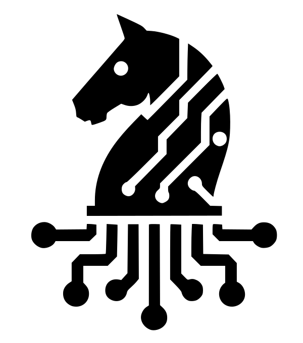

---

---

# Welcome to the world of Zarhus - Your Digital Chess Knight 👋

Inspired by the elegance and strategic prowess of the "huszár", meaning knight
in chess (Polish: skoczek), Zarhus brings a unique blend of tradition and
innovation to your embedded systems experience.

## 🧭 Mission and Vision

Zarhus is an embedded Linux distribution developed by 3mdeb, based on the Yocto
Project. It simplifies the provisioning, integration, and maintenance of
embedded platforms, with a strong focus on leveraging Root of Trust and Chain of
Trust Technologies. This ensures that our clients' applications can be securely
and reliably deployed.

### Mission

* Host vMeetups and face-to-face training conferences to boost knowledge of
  embedded systems booting and security.
* Navigate through growing complexity of boot chain of modern computing.
* Simplifying hardware security enablement.

### Vision

* Systems become secure, trustworthy, and repairable.
* Modern tools enhance creativity and collaboration without replacing human
  purpose.
* Communities can thrive with technology that respects freedom, simplicity, and
  sovereignty.

### Strategy

* Extend core firmware components (U-Boot, ARM Trusted Firmware, Linux Kernel)
  toward a fully open, reproducible, and auditable Root and Chain of Trust.
* Integrate cutting-edge hardware security building blocks (secure storage,
  secure elements, embedded dTPM solutions, OP-TEE-based firmware TPM, encrypted
  root filesystems) to ensure measurable integrity and resilience.
* Develop tooling for Root of Trust (RoT) and Chain of Trust (CoT) with
  long-term maintainability in mind.
* Collaboratively participate in communities aligned with freedom, sovereignty,
  and simplicity—particularly those around Dasharo, OpenXT, Qubes OS,
  Kicksecure, FreeBSD, OpenWRT, Debian, Fedora, and similar technology
  ecosystems.
* Adopt an iterative, demo-driven approach to project execution, continuously
  communicating progress through derivative products that demonstrate real-world
  applicability and validate ideas in practical scenarios.
* Project progress reporting using derivative products and demo-driven approach.

To learn more, check out the [Welcome
presentation](https://youtu.be/F3349PVOGZY?si=z1uqlaQSQe22hoV4&t=309) from the
Zarhus Developers Meetup 0x1.

## ❓ Why choose Zarhus

### 🛡️ Deeper Meaning, Tactical Innovation

Delve into the world of chess analogies with Zarhus. Our name is more than just
a label; it's a symbol of strategic brilliance and tactical adaptability,
mirroring the knight's unconventional moves on the chessboard. Just as the
knight navigates through complex scenarios, Zarhus operates seamlessly in the
hardware integration area, showcasing adaptability and versatility.

### 💡 Innovation at Every Move

Zarhus isn't just an operating system; it's your digital chess knight, making
moves that matter. Experience the innovation that comes with a system designed
to adapt, secure, and conquer the complexities of the ever-evolving embedded
solutions.

### 🌐 Your Digital Landscape, Secured

Just as the knight secures the chessboard, Zarhus safeguards your embedded
systems. Navigate through the intricate ecosystem of hardware and software with
ease, confident in the adaptability and resilience that Zarhus provides.

## 🌍 Community

Become a part of the Zarhus community:

* **Chat with Us**: Join the conversation in the [Dasharo Matrix
  Workspace](https://matrix.to/#/#dasharo:matrix.org) where you can ask about
  the Zarhus OS, Dasharo Tools Suite, meta-rte and more!
* **Stay Updated**: Join our quarterly live [events](https://3mdeb.com/events/)
  featuring:
    + **Zarhus Developers Meetup (ZDM)**: Explore the latest updates in the
      Zarhus ecosystem.
    + **Dasharo User Group (DUG)**: A forum for Dasharo users to connect, share
      experiences, and stay informed.
    + **Dasharo Developers vPub**: A relaxed virtual meetup for developers and
      enthusiasts to discuss, share, and connect.

We aim to grow this community and create dedicated social events related to
Zarhus products in the future. Stay tuned!

## 👥 Our contribution

Zarhus is a product developed by [3mdeb](https://github.com/3mdeb). Zarhus
benefits from 3mdeb CI/CD, documentation and layer optimization of many embedded
platforms maintained for years.

Together we contributed over **4.3k lines of code** to various embedded systems
open-source projects and tools 🔧 we rely on to build and run Zarhus products:

* [Yocto Poky](https://git.yoctoproject.org/poky/)
* [systemd](https://github.com/systemd/systemd)
* [meta-openembedded](https://github.com/openembedded/meta-openembedded)
* [openembedded-core](https://git.openembedded.org/openembedded-core)
* [meta-riscv](https://github.com/riscv/meta-riscv)
* [meta-swupdate](https://github.com/sbabic/meta-swupdate)
* [SWUpdate](https://sbabic.github.io/swupdate/)
* [meta-openwrt](https://github.com/kraj/meta-openwrt)
* [meta-virtualization](https://git.yoctoproject.org/meta-virtualization/)
* [meta-security](https://git.yoctoproject.org/meta-security/)
* [meta-measured](https://github.com/flihp/meta-measured)
* [meta-webkit](https://github.com/Igalia/meta-webkit)

We also maintain 🧙‍♂️ our own forks and open-source projects like:

* [meta-dts](https://github.com/Dasharo/meta-dts)
* [meta-rte](https://github.com/3mdeb/meta-rte)
* [meta-fdo](https://github.com/3mdeb/meta-fdo)
* [meta-balena-engine](https://github.com/3mdeb/meta-balena-engine)
* [meta-trenchboot](https://github.com/3mdeb/meta-trenchboot)
* [meta-pcengines](https://github.com/3mdeb/meta-pcengines)

Zarhus public roadmap can be found
[here](https://github.com/zarhus/zarhus-issues/milestones).

<!-- ^TBD: check links after roadmap finalization -->

## 📘 How to contribute

Please start in the [newcomer](newcomers.md) section.
