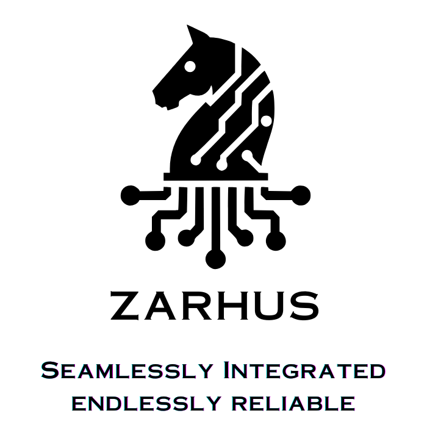

  

# Welcome to Zarhus

**Zarhus** is an  embedded Linux distribution developed by
[3mdeb](https://3mdeb.com), built on top of the [Yocto
Project](https://www.yoctoproject.org/). It simplifies provisioning,
integration, and maintenance of embedded platforms placing security at its core
with strong emphasis on **Root of Trust** (RoT) and **Chain of Trust** (CoT)
technologies. Our goal is to ensure embedded applications are deployed in
trustworthy way.

---

## 🎯 Mission

* Host **vMeetups** and hands-on training to empower developers with knowledge
of secure boot and embedded systems.
* Help users navigate the growing complexity of modern boot chains.
* Simplify hardware security enablement in a reproducible and transparent way.

---

## 🌅 Vision

We envision a world where:

* Systems are **secure**, **trustworthy**, and **repairable**.
* Tools enhance **creativity** and **collaboration** without diminishing human
purpose.
* Communities thrive through technology that respects **freedom**,
**simplicity**, and **digital sovereignty**.

---

## 🛠️ Strategy

To achieve this vision, Zarhus:

* Extends core firmware components like **U-Boot**, **ARM Trusted Firmware**,
and the **Linux Kernel** to build an auditable and reproducible Root and Chain
of Trust.
* Integrates advanced hardware security features: secure storage, secure
elements, embedded TPMs (e.g., OP-TEE TPMs), encrypted root filesystems, and
more.
* Builds long-term maintainable tooling to support RoT and CoT.
* Actively collaborates with like-minded communities, such as Dasharo, OpenXT,
Qubes OS, Kicksecure, FreeBSD, OpenWRT, Debian, and Fedora.
* Follows a **demo-driven, iterative development approach**, emphasizing
real-world applicability and constant feedback.
* Regularly reports progress through working demos and derivative products.

👉 Watch the [Welcome Presentation](https://youtu.be/F3349PVOGZY?si=z1uqlaQSQe22hoV4&t=309) from Zarhus Developers Meetup 0x1.

---

## 🧩 What's in the Name?

The name **Zarhus** is an anagram of the Hungarian word _"huszár"_ a knight in
chess and a nod to the Polish **Husaria**, renowned heavy cavalry. It
symbolizes agility, strength, and strategy qualities we bring to embedded
system security.

---

## 🌍 Join the Community

Be part of Zarhus and contribute to a growing ecosystem:

* **💬 Chat with us**: Join the [Zarhus Matrix
Workspace](https://matrix.to/#/#zarhus:matrix.org) to discuss Zarhus OS,
Dasharo Tools Suite, `meta-rte`, and more.
* **📅 Attend events**: Join our quarterly [Zarhus Developers Meetup
(ZDM)](https://3mdeb.com/events/) for updates, demos, and discussions around
the Zarhus ecosystem.

We are continuously growing and plan to introduce dedicated social events and
community spaces—stay tuned!

---

## 👥 Our Contribution

**Zarhus** is proudly developed by [3mdeb](https://github.com/3mdeb),
leveraging years of experience in embedded systems, CI/CD, documentation, and
Yocto layer optimization.

We’ve contributed **4,300+ lines of code** to upstream open-source projects
essential to Zarhus:

* [Yocto Poky](https://git.yoctoproject.org/poky/)
* [systemd](https://github.com/systemd/systemd)
* [meta-openembedded](https://github.com/openembedded/meta-openembedded)
* [meta-riscv](https://github.com/riscv/meta-riscv)
* [meta-swupdate](https://github.com/sbabic/meta-swupdate)
* [meta-openwrt](https://github.com/kraj/meta-openwrt)
* [meta-security](https://git.yoctoproject.org/meta-security/)
* [meta-virtualization](https://git.yoctoproject.org/meta-virtualization/)
* and more…

We also maintain our own open-source layers and tools, including:

* [meta-dts](https://github.com/Dasharo/meta-dts)
* [meta-rte](https://github.com/3mdeb/meta-rte)
* [meta-fdo](https://github.com/3mdeb/meta-fdo)
* [meta-balena-engine](https://github.com/3mdeb/meta-balena-engine)
* [meta-trenchboot](https://github.com/3mdeb/meta-trenchboot)
* [meta-pcengines](https://github.com/3mdeb/meta-pcengines)

📍 Check out the [Zarhus public roadmap](https://github.com/zarhus/zarhus-issues/milestones) to track our progress and plans.

---

## 🤝 How to Contribute

We welcome contributors of all experience levels! Start with our [Newcomer
Guide](newcomers.md) to get up to speed.

Whether you're interested in improving documentation, contributing code, or
testing new features, there's a place for you in the Zarhus community.
