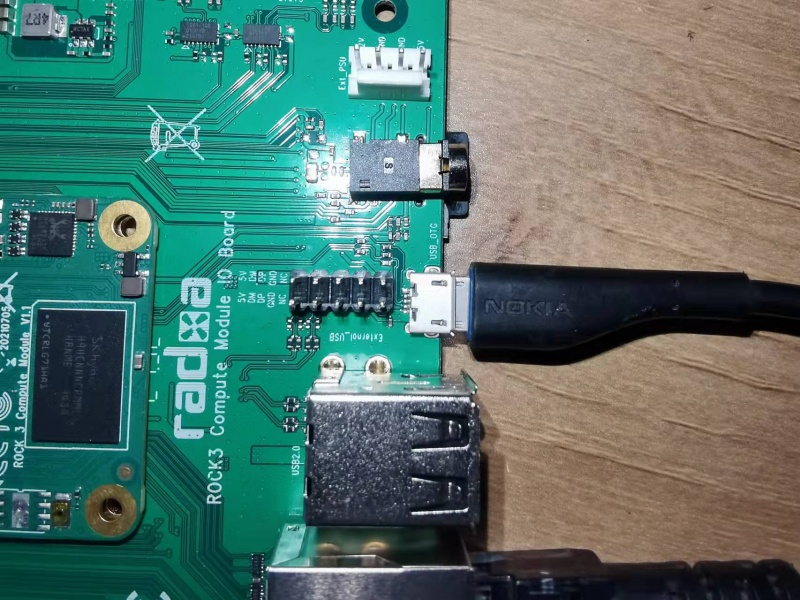
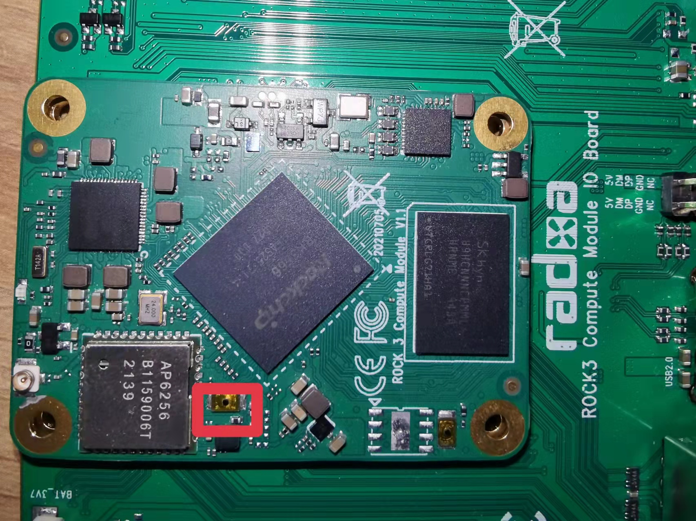

# Radxa CM3

## Description and resources

The [CM3](https://wiki.radxa.com/Rock3/CM3) is a System on Module based on
Rockchip RK3566 and produced by Radxa. Its developing potential can be revealed
in connection with [CM3 IO](https://wiki.radxa.com/Rock3/CM3/IO) board.

Additional resources for the boards:

* [`radxa/radxa-cm-projects`;](https://github.com/radxa/radxa-cm-projects/tree/main/cm3)
* [CM3 design resources;](https://radxa.com/products/cm/cm3/#design-resources)
* [Rockchip Wiki: partitions map;](https://opensource.rock-chips.com/wiki_Partitions)
* [Rockchip Wiki: boot flow.](https://opensource.rock-chips.com/wiki_Boot_option#Boot_introduce)

## Serial port access (Zarhus OS debug console)

Numerous types of software can be used to communicate via serial ports. On a
host machine with Linux-based OS it can be `minicom`, Windows users can access
that with [PuTTY](https://www.putty.org/).

There are only two parameters that depend not only on hardware but on software
as well: baudrate and serial port number. In case of Radxa CM3 port - Zarhus OS
gives access to console via serial port 2 with baudrate `1.5 Mbps`, so you can
connect to the console by connecting the UART adapter to [pins `6`, `8` and
`10`](https://wiki.radxa.com/Rock3/CM3/IO/GPIO) of
[`CON1`](https://wiki.radxa.com/Rock3/CM3/IO/pinout) on Radxa CM3 IO board:


And use following command on your host Linux distribution:

```bash
$ minicom -b 1500000 -D /dev/ttyUSBX
```

Where instead of `/dev/ttyUSBX` there should be the name of your UART adapter
under your host Linux distribution.

## eMMC Flashing

This guide presents the workflow of flashing a Zarhus OS image on Radxa CM3 eMMC
memory.

### Hardware overview

List of hardware elements used in the workflow:

* **Target**: [Radxa Compute Module 3][cm3] with [Radxa CM3 IO Board][iob]
* **Power supply**: 12V/2A
* **Cable**: Male USB A to male USB Micro B

[cm3]: https://wiki.radxa.com/Rock3/CM/CM3
[iob]: https://wiki.radxa.com/Rock3/CM3/IO

### Software overview

The Zarhus OS image from release `0.1` is being used during the workflow steps
presented below. The image can be built from
[here](https://github.com/zarhus/meta-zarhus/tree/v0.1). Check out the [building
guide](../getting-started/building.md) for details about Zarhus OS building process.

A Rockchip-specific tool, `rkdeveloptool`, will be used during the flashing
step. The source code from which the tool will be built can be found 
[here](https://github.com/radxa/rkdeveloptool).

### Preparing tools

A tool `rkdeveloptool` should be built and installed before proceeding with the
workflow. Follow the below steps to complete installation:

Install dependencies:

```bash
sudo dnf install systemd-devel libusb1-devel autoconf libusb1 pkgconf-pkg-config
sudo dnf group install "C Development Tools and Libraries" "Development Tools"
```
!!! note

    On Ubuntu, you should have installed: `libudev-dev`, `libusb-1.0-0-dev`,
    `dh-autoreconf`, `pkg-config`, `lib-usb-1.0`, `build-essential`, `git`, and
    `wget`. The group `C Development Tools and Libraries" "Development Tools`
    installed above is a replacement for Ubuntu `build-essential` package, and
    `libudev` files are a part of `systemd-devel`.

Fetch the tool from its repository:

```bash
git clone https://github.com/radxa/rkdeveloptool
cd rkdeveloptool
```

Checkout version `1.32`:

```bash
git checkout ac50fcb73a63af566ea728464e376131b9384948
```

Configure build:

```bash
autoreconf -i
./configure
```

Build:

```bash
make
```

Install:

```bash
sudo cp rkdeveloptool /usr/local/bin/
sudo ldconfig
```

Verify the version of the installed tool (it should be `1.32`):

```bash
rkdeveloptool -v
```

### Preparing Zarhus OS image

Build the Zarhus OS image version `0.1` according to the [building
guide](../getting-started/building.md).

After the image has been built - locate and copy the image to a known location:


```bash
cp build/tmp/deploy/images/zarhus-machine-cm3/zarhus-base-image-IMAGE_VER-zarhus-machine-cm3.rootfs.wic.gz ./
```

!!! note

    Replace `IMAGE_VER` with either `debug` or `prod` depending on the `.yml`
    file you used in previous step.

Decompress the image (`rkdeveloptool` needs decompressed image):

```bash
gunzip zarhus-base-image-IMAGE_VER-zarhus-machine-cm3.rootfs.wic.gz
```

!!! note

    Replace `IMAGE_VER` with either `debug` or `prod` depending on the `.yml`
    file you used in previous step.

Now you should have decompressed image file in your directory:

```bash
file ./zarhus-base-image-IMAGE_VER-zarhus-machine-cm3.rootfs.wic 
zarhus-base-image-IMAGE_VER-zarhus-machine-cm3.rootfs.wic: DOS/MBR boot sector; partition 1 : ID=0xee, start-CHS (0x0,0,2), end-CHS (0x3ff,255,63), startsector 1, 687763 sectors, extended partition table (last)
```

!!! note

    Replace `IMAGE_VER` with either `debug` or `prod` depending on the `.yml`
    file you used in previous step.


### Flashing

The `rkdeveloptool` installed in the [Preparing tools](#preparing-tools) chapter
will be used for flashing the Zarhus OS image on the platform. Prepare the
platform for eMMC flashing:

Plug out power and eject SD card from the platform, then connect USB Micro B to
the board USB OTG interface:



<!-- Source: https://wiki.radxa.com/File:Cm3_io_micro_usb.jpeg -->

Then, connect USB A to host PC port. Press and hold SoM maskrom button showed on
the image below:



<!-- Source: https://wiki.radxa.com/File:Cm3-io-key.jpeg -->

Connect the power supply to the board and release the maskrom button.

After the board has been powered on, confirm, that the platform has been
detected by the host PC:

```bash
lsusb | grep '350a'
Bus 003 Device 007: ID 2207:350a Fuzhou Rockchip Electronics Company
```

Confirm, that the platform is in maskrom state (repeat above steps if not):

```bash
rkdeveloptool ld
DevNo=1	Vid=0x2207,Pid=0x350a,LocationID=303	Maskrom
```

Now the platform is ready for flashing. Initialize SoC before flashing eMMC:

```bash
wget https://dl.radxa.com/rock3/images/loader/radxa-cm3-io/rk356x_spl_loader_ddr1056_v1.10.111.bin
rkdeveloptool db rk356x_spl_loader_ddr1056_v1.10.111.bin
Downloading bootloader succeeded.
```

!!! note

    The `rkdeveloptool` might need `root` rights to open `com` ports,
    precede the command with `sudo` and provide `root` password if it is
    necessary for your host OS.

Flash eMMC:

```bash
rkdeveloptool wl 0x0 zarhus-base-image-IMAGE_VER-zarhus-machine-cm3.rootfs.wic
Write LBA from file (100%)
```

!!! note

    The `rkdeveloptool` might need `root` rights to open `com` ports, precede
    the command with `sudo` and provide `root` password if it is necessary for
    your host OS. Replace `IMAGE_VER` with either `debug` or `prod` depending on
    the `.yml` file you used in previous steps.

Reset the platform:

```bash
rkdeveloptool rd
Reset Device OK.
```

!!! note

    The `rkdeveloptool` might need `root` rights to open `com` ports,
    precede the command with `sudo` and provide `root` password if it is
    necessary for your host OS.

From now the eMMC has been flashed, you can unplug the USB cable and verify if
the OS is working properly on the platform.
